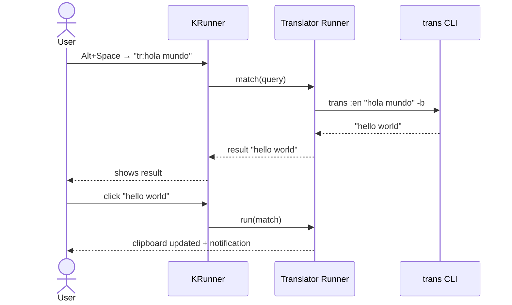
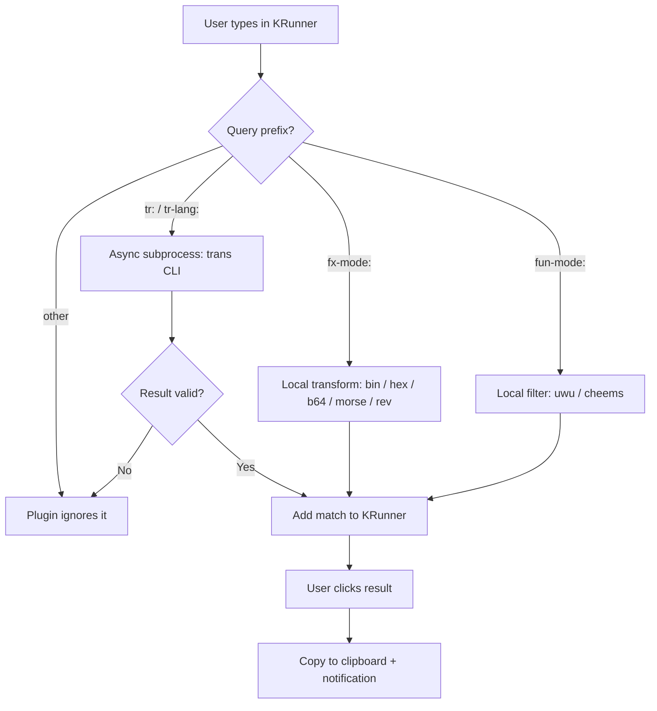

# Translator Runner

> Inline text translation directly from KDE's application launcher.

[](https://www.gnu.org/licenses/gpl-3.0)
[](https://kde.org/plasma-desktop/)
[](https://api.kde.org/frameworks/)

---

## What is it?

**Translator Runner** is a [KRunner](https://userbase.kde.org/Plasma/Krunner) plugin for KDE Plasma 6. It lets you translate text and transform it without leaving your keyboard — open the launcher, type your query, and the result appears instantly. Click it and it's in your clipboard.

No browser tab. No switching apps. Just `Alt+Space` and type.

---

## Why it exists

The widely-used `krunner-translator` plugin broke on Plasma 6.6+ / Qt 6.10, crashing with `qBadAlloc` due to API changes in KDE Frameworks 6. This is a clean rewrite built from scratch targeting the modern KF6 stack.

---

## Usage

### Translation

Press `Alt+Space` to open KRunner, then:

| Syntax | What it does |
|---|---|
| `tr:hola mundo` | Translates to English (default) |
| `tr-es:hello world` | Translates to Spanish |
| `tr-fr:good morning` | Translates to French |
| `tr-de:hello` | Translates to German |
| `tr-ja:hello` | Translates to Japanese |
| `tr-ru:hello` | Translates to Russian (Cyrillic) |
| `tr-zh:hello` | Translates to Chinese (Simplified) |
| `tr-ar:hello` | Translates to Arabic |
| `tr-qu:hello` | Translates to Quechua |
| `tr-ay:hello` | Translates to Aymara |

Any [ISO 639-1 language code](https://en.wikipedia.org/wiki/List_of_ISO_639_language_codes) works after `tr-`, including regional variants like `tr-zh-TW:` or `tr-pt-BR:`.

**Shorthand aliases:** `tr-cn:` → Chinese · `tr-jp:` → Japanese · `tr-br:` → Portuguese · `tr-kr:` → Korean.

Click the result → translation is copied to your clipboard + a KDE notification confirms it.

---

### Local text transforms

These run entirely inside the plugin — no network, no subprocess, instant results.

| Syntax | What it does | Example |
|---|---|---|
| `fx-bin:<text>` | Converts text to binary | `fx-bin:hi` → `01101000 01101001` |
| `fx-hex:<text>` | Converts text to hexadecimal | `fx-hex:hi` → `68 69` |
| `fx-b64:<text>` | Encodes text as Base64 | `fx-b64:hello` → `aGVsbG8=` |
| `fx-morse:<text>` | Converts text to Morse code | `fx-morse:sos` → `... --- ...` |
| `fx-rev:<text>` | Reverses the text | `fx-rev:hello` → `olleh` |

---

### Fun filters

| Syntax | What it does | Example |
|---|---|---|
| `fun-uwu:<text>` | Applies uwu-style text filter | `fun-uwu:hello world` → `hewwo wowwd` |
| `fun-cheems:<text>` | Applies Cheems meme filter | `fun-cheems:hola mundo` → `homla mumdo` |

The Cheems filter inserts `m` before consonants that follow vowel sequences, matching the algorithm from [cheemsify](https://github.com/Xeroth-20/cheemsify). Supports accented vowels (á, é, í, ó, ú) for Spanish text.

---

## User flow



For `fx-` and `fun-` queries the flow is the same but the plugin computes the result locally — no CLI call.

---

## How it works

Translator Runner sits inside KRunner as a shared library (`.so`). When KRunner starts, it scans its plugin directory and loads every plugin it finds — including this one. From that point on, every query the user types gets passed to all loaded plugins simultaneously.



The translation itself is handled by [translate-shell](https://github.com/soimort/translate-shell) (`trans`), a command-line tool that supports Google Translate, Bing, and DeepL as backends. The plugin spawns it as an async subprocess, captures the output, and surfaces it as a KRunner result. Local transforms and fun filters are computed entirely in C++ with no external dependencies.

---

## Tech stack

| Layer | Technology |
|---|---|
| Plugin interface | KDE Frameworks 6 — `KF6::Runner` |
| Plugin registration | `KF6::CoreAddons` |
| Notifications | `KF6::Notifications` |
| Internationalization | `KF6::I18n` |
| Qt layer | Qt 6 — `QProcess`, `QClipboard`, `QString`, `QRegularExpression` |
| Translation backend | [translate-shell](https://github.com/soimort/translate-shell) (`trans` CLI) |
| Build system | CMake 3.20+ with Extra CMake Modules (ECM) |
| Language | C++17 |

---

## Installation

### Requirements

- KDE Plasma 6.5+
- KDE Frameworks 6.0+
- Qt 6.5+
- CMake 3.20+
- `translate-shell` (`trans` binary in PATH)

### Install dependencies (Fedora)

```bash
sudo dnf install gcc-c++ cmake extra-cmake-modules \
    qt6-qtbase-devel kf6-krunner-devel kf6-kcoreaddons-devel \
    kf6-ki18n-devel kf6-knotifications-devel kf6-kconfig-devel \
    translate-shell
```

### Build and install

```bash
git clone https://github.com/eJosR-Coding/translator-runner.git
cd translator-runner
mkdir build && cd build
cmake -DCMAKE_INSTALL_PREFIX=/usr ..
make -j$(nproc)
sudo make install
killall krunner
```

Then open **System Settings → Search → Plasma Search**, find **Translator Runner** and enable it.

---

## Roadmap

- [x] Translation via translate-shell
- [x] Multi-language support (`tr-XX:` syntax)
- [x] Clipboard copy on selection
- [x] KDE notification on copy
- [x] Async translation (non-blocking)
- [x] Multi-script support — Cyrillic, CJK, Arabic, Hebrew, Thai, Devanagari, Quechua, Aymara and more
- [x] Language aliases (`tr-cn:`, `tr-jp:`, `tr-br:`, `tr-kr:`)
- [x] Regional variants (`tr-zh-TW:`, `tr-pt-BR:`)
- [x] Local text transforms (`fx-bin:`, `fx-hex:`, `fx-b64:`, `fx-morse:`, `fx-rev:`)
- [x] Fun filters (`fun-uwu:`, `fun-cheems:`)
- [ ] Translation history
- [ ] Configuration UI in System Settings

---

## License

GPL-3.0-or-later. See [LICENSE](LICENSE).
